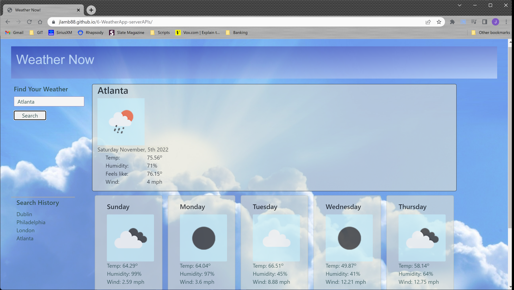

# 6- Weather - Server-side APIs
## Description
Weather application to provide current and five day forecast with visual icons to represent conditions
### User Story
```
AS A traveler
I WANT to see the weather outlook for multiple cities
SO THAT I can plan a trip accordingly
```
### Acceptance Criteria
```
GIVEN a weather dashboard with form inputs
WHEN I search for a city, zip code or city,state
THEN I am presented with current and future conditions for that city and that city is added to the search history
WHEN I view current weather conditions for that city
THEN I am presented with the city name, the date, an icon representation of weather conditions, the temperature, the humidity, the wind speed
WHEN I view future weather conditions for that city
THEN I am presented with a 5-day forecast that displays the date, an icon representation of weather conditions, the temperature, the wind speed, and the humidity
WHEN I click on a city in the search history
THEN I am again presented with current and future conditions for that city
```
## Installation

GitHub: https://github.com/jlamb88/6-WeatherApp-serverAPIs.git

URL: https://jlamb88.github.io/WeatherApp-serverAPI

## Usage




## Credits
Primary Developer: Joseph Lamb

Github: https://github.com/jlamb88

## Badges


